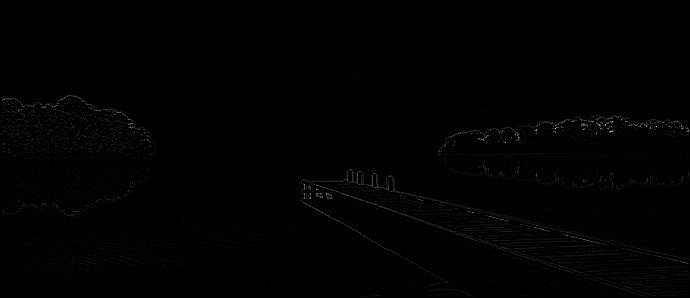
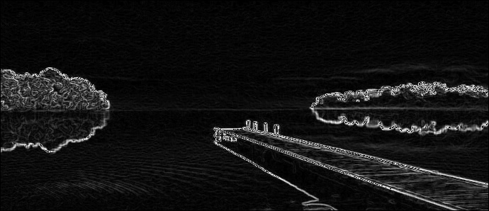

# Image Filtering using CUDA

This is the implementation of 6 image filters, including Box Filter, Median Filter, Sobel Filter, Laplacian Filter, Sharpenning Filter and TV Filter using CUDA on GPU. I also implemented these filters using C++ and OpenCV to measure the speed up that can be achieved using GPU over CPU. The following table shows the results. It can be seen from the results that on average we can get 3.3 faster processing on GPU.
The experiments have been done on GTX970.

| Filtering Method  |  Speed on CPU (ms) | Speen on GPU (ms) | Image Resolution |
| :---:             | :---: | :---: | :---: |
| Box Filter        | 3.26 | 0.93 | 690*298 |
| Gaussian Filter   | 3.17 | 0.95 | 690*298 |
| Laplacian Filter  | 3.55 | 0.92 | 690*298 |
| Median Filter     | 3.18 | 0.92 | 690*298 |
| Sharpening Filter | 3.18 | 0.92 | 690*298 |
| TV Filter         | 3.18 | 0.92 | 690*298 |

These are example of the input image and resulted image after filtering:

Original image:

  

Filtered image by Box filtering:

  

Filtered image by Laplacian filtering:

  

Filtered image by Median filtering:

  

Filtered image by Sharpening filtering:

  

Filtered image by Sobel filtering:

  

Filtered image by TV filtering:

  

